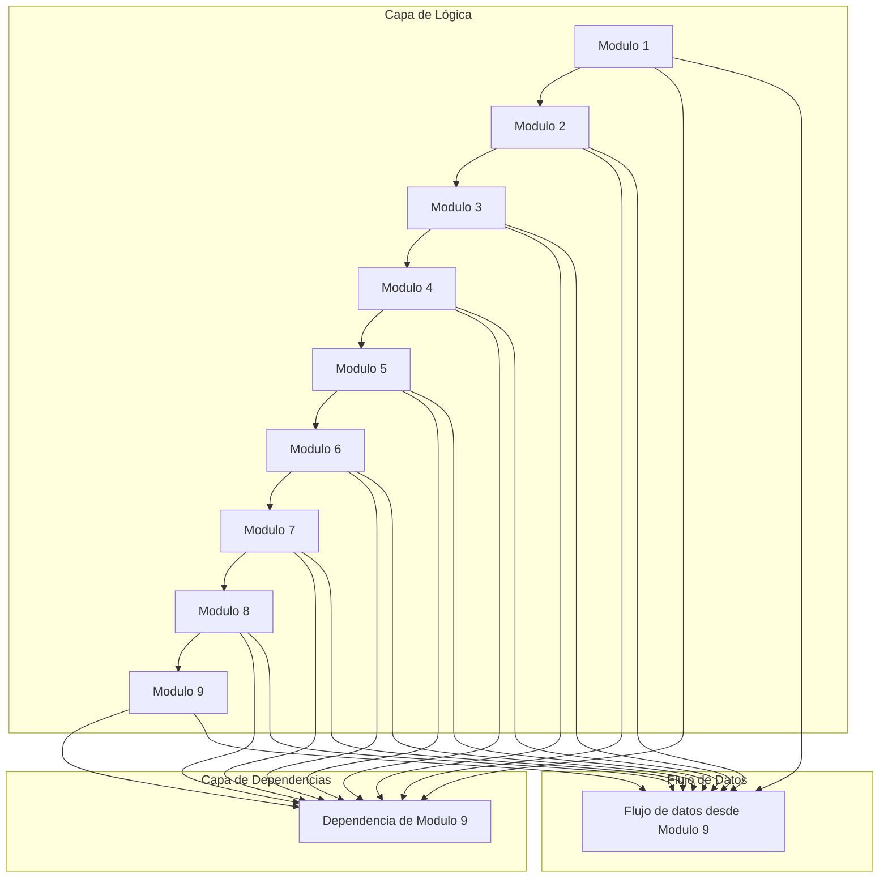

```mermaid
graph TD
    subgraph "Capa de Lógica"
        A["Modulo 1"] --> B["Modulo 2"]
        B --> C["Modulo 3"]
        C --> D["Modulo 4"]
        D --> E["Modulo 5"]
        E --> F["Modulo 6"]
        F --> G["Modulo 7"]
        G --> H["Modulo 8"]
        H --> I["Modulo 9"]
    end
    subgraph "Capa de Dependencias"
        A --> J["Dependencia de Modulo 1"]
        B --> J["Dependencia de Modulo 2"]
        C --> J["Dependencia de Modulo 3"]
        D --> J["Dependencia de Modulo 4"]
        E --> J["Dependencia de Modulo 5"]
        F --> J["Dependencia de Modulo 6"]
        G --> J["Dependencia de Modulo 7"]
        H --> J["Dependencia de Modulo 8"]
        I --> J["Dependencia de Modulo 9"]
    end
    subgraph "Flujo de Datos"
        A --> K["Flujo de datos desde Modulo 1"]
        B --> K["Flujo de datos desde Modulo 2"]
        C --> K["Flujo de datos desde Modulo 3"]
        D --> K["Flujo de datos desde Modulo 4"]
        E --> K["Flujo de datos desde Modulo 5"]
        F --> K["Flujo de datos desde Modulo 6"]
        G --> K["Flujo de datos desde Modulo 7"]
        H --> K["Flujo de datos desde Modulo 8"]
        I --> K["Flujo de datos desde Modulo 9"]
    end
```